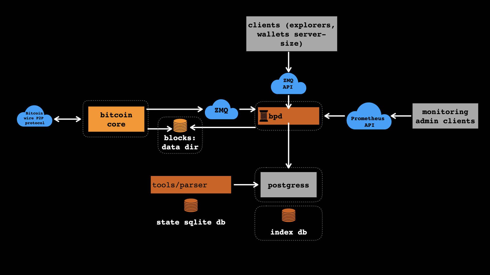

# bpd: Bitcoin protocol daemon written in Rust

`bpd` replaces Bitcoin Core in parts of its outdated JSON API and
different indexing servers (like Electrum) for efficient and extended
queries against bitcoin blockchain (see the drawing below).

The daemon is made with focus on:
* non-blocking/async IO and APIs
* ZMQ APIs for the clients
* efficient indexing with
  [LNPBP-5 standard](https://github.com/LNP-BP/lnpbps/blob/master/lnpbp-0005.md)
* native miniscript support
* arbitrary complex queries against bitcoin transactions and their parts
* layer 2/3 protocols in mind
* native support for the new rust 
  [Lightning network node](https://github.com/LNP-BP/lnp-node) `lnp-node`

The repository also contains a tool for building initial blockchain index.

NB: This is (not yet) a full validating node!



## Installation

You need to install nightly rust version and have PostgreSQL with
default access settings

```shell script
rustup install nightly
rustup default nightly
git clone https://github.com/LNP-BP/bp-node
cd bp-node
./setup.sh
cargo build
```

## Usage

Assuming your bitcoin core directory is `/var/lib/bitcoin` you may
simply run

```shell script
./target/debug/bp-index -v -v -v -v
```

otherwise you may provide custom location & database settings with
specific flags.
